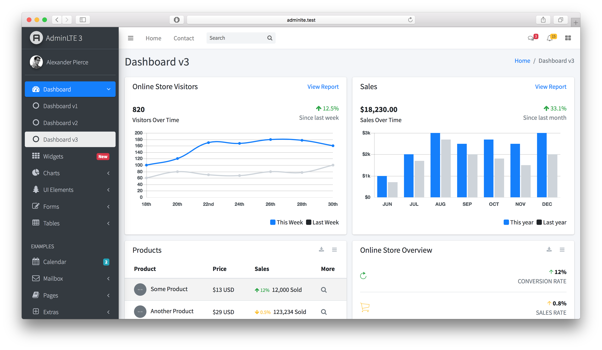

# AdminLTE Vue.js (adminlte-vuejs)

Converter o projeto [AdminLTE (v3.2.0) - Bootstrap 5 Admin Dashboard](https://github.com/ColorlibHQ/AdminLTE/releases/tag/v3.2.0) para um projeto [Vue.js Framework](https://vuejs.org/guide/introduction.html).

Se trata de um projeto prático prova de conceito POC para deixar pegadas digitais e ser próativo para os processos seletivos onde as equipes técnicas de recrutadores tenham condições e evidências para verificar se o meu perfil pode atender as necessidades das oportunidades.


## Proficiências

Procuro evidência as proficiências nas seguintes habilidades técnicas:

- [Vue.js Framework](https://vuejs.org/guide/introduction.html);
- Stacks de [rotinas operacionais de Front-end]();
- Aplica [Abordagem API First](https://swagger.io/resources/articles/adopting-an-api-first-approach/) com foco em: [Os Doze Fatores](https://12factor.net/pt_br/)
- Técnicas em [Análise Código-fonte Legados](#FEATHERS-michael);
- Técnicas em [Refatoração Código-fonte Legados](#FEATHERS-michael) e de Projeto Open Source:
    - [Vue.js Framework](https://vuejs.org/guide/introduction.html) principais funcionalidades:
        - [Padrão de Arquitetura PRPL](): Push | Render | Precache | Lazy-load
        - [Virtual DOM]()
        - [Components]()
        - [Templates]()
        - [Routing]()
        - [Lightweight]()
        - [Comunicação entre Componentes]()
        - [Notifications API]()

Projeto inicializado com o [`Script Automação`](scripts/src/main/criar_projeto_adminLTE_vuejs.sh): artefato `scripts/src/main/criar_projeto_adminLTE_vuejs.sh`

## 🚀 Começando

### 📋 Pré-requisitos

De que coisas precisamos para instalar o software e como instalá-lo?

```bash
##############################################
# Instalação do NodeJS no Fedora
##############################################
sudo dnf install nodejs.x86_64
node -v
##############################################

##############################################
# Instalação do Node Version Manager no Fedora
##############################################
export NVM_VERSION="v0.39.3"

curl -o- "https://raw.githubusercontent.com/nvm-sh/nvm/${NVM_VERSION}/install.sh" | bash

nvm -v
nvm install --lts

##############################################

##############################################
# Instalação Typescript, Vue.js 
##############################################
nvm use --lts
npm install -g typescript @vue/cli
##############################################

```

### 🔧 Instalação

Para obter o presente projeto use os seguintes comandos:

```bash
export ARTIFACT_ID="adminlte-vuejs"
export WORK_PATH="${HOME}/projetos/${ARTIFACT_ID}"
mkdir -p "${HOME}/projetos"
cd "${HOME}/projetos"
git clone https://github.com/pssilva/${ARTIFACT_ID}.git
cd "${WORK_PATH}"
code .
```

Em um terminal execute a aplicação com os seguintes comandos:

```bash
cd "${WORK_PATH}"
nvm use --lts
npm run dev 
```

Abra [http://localhost:4200/](http://localhost:4200/) com o seu navegador.

Em um terminal execute a aplicação do AdminLTE com os seguintes comandos:

```bash
cd "${WORK_PATH}"
nvm use --lts
npm run dev
```

Abra [http://localhost:3000/](http://localhost:3000/) com o seu navegador.

## Saiba Mais

Para saber mais sobre Vue.js Framework, dê uma olhada nos seguintes recursos:

- [Vue.js Framework](https://vuejs.org/guide/introduction.html) - aprenda sobre os recursos e API do Vue.js Framework.
- [Learn Vue.js tutorial](https://Vue.js.dev/tutorials/learn-Vue.js) - um tutorial interativo do Vue.js Framework.

Você pode conferir [o repositório Vue.js Framework](https://github.com/Vue.js/Vue.js) - seus comentários e contribuições são bem-vindos!

## Implantar no Heroku

A maneira mais fácil de implantar seu aplicativo Vue.js é usar a [Plataforma do Heroku](https://devcenter.heroku.com/start) dos criadores do [Os Doze Fatores (The Twelve-Factor App)](https://12factor.net/pt_br/).

Confira [documentação de implantação do Heroku](https://devcenter.heroku.com/start) para mais detalhes.

---

## Template HTML AdminLTE

<a href="https://github.com/ColorlibHQ/AdminLTE?tab=readme-ov-file#adminlte---bootstrap-5-admin-dashboard"></a>


---

## 🔩 Débitos Técnicos

Aqui temos uma lista do que idenficamos com status de pendente:

### Funcionalidades Aplicação

Segue abaixo (não se limita) os objetivos do presente projeto:

- [X] ~~Formatando documentação README.md~~
- [X] [INDEXAÇÃO VÍDEO 3237 – 03.04.07.07 – Técnicas avançadas de aprendizado acelerado para devs que usam Java no backend – Elder Moraes – Questões](INDEXAÇÃO%20VÍDEO%203237%20–%2003.04.07.07%20–%20Técnicas%20avançadas%20de%20aprendizado%20acelerado%20para%20devs%20que%20usam%20Java%20no%20backend%20–%20Elder%20Moraes%20–%20Questões.pdf). Vídeo totalmente indexada!
- [ ] Conversão Arquivos de Configurações necessários
- [ ] Conversão Pastas necessárias
- [ ] Fatiar o Template HTML [AdminLTE - Bootstrap 5 Admin Dashboard](https://github.com/ColorlibHQ/AdminLTE?tab=readme-ov-file#adminlte---bootstrap-5-admin-dashboard) em componentes Vue.js
- [ ] Estilização do componente `src/app/components/app-header/app-header.component.ts`
- [ ] Estilização do componente `src/app/components/app-header/app-sidebar.component.ts`
- [ ] Fatiar, em componentes Vue.js reutilizáveis, os seguintes artefatos:
  - [ ] `src/html/pages/index.astro`
  - [ ] `src/html/pages/index2.astro`
  - [ ] `src/html/pages/index3.astro`
- [ ] Convertendo tag HTML header em um componente Vue.js;
- [ ] Abstrarir Componentes reutilizáveis especificos para o AdminETL
- [ ] Converter funcionalidades jQuery para componentes Vue.js reutilizáveis
- [ ] Implementar os rescursos do [Vue.js Framework](https://vuejs.org/guide/introduction.html)
- [ ] Realizar [Análise Exploratória](#da-analise-exploratoria) dos seguintes projetos Open-Source: 
  - [ ] [AdminLTE (v3.2.0)](https://github.com/ColorlibHQ/AdminLTE/releases/tag/v3.2.0)
  - [ ] [[TRABALHO EM PROGRESSO]]()


### Atividades - DevOps

- [ ] Implementação dos Pipelines CI/CD de Implatação num Provedor de Nuvem (mais detalhes veja [aqui](repo-docs/provedores_nuvem/README.md)).
- [ ] Implementar restrições de Commit no Git: vinculado com o ID de regra de negócio e ID do checklist de validação das entragas de funcionalidades (mais detalhes [aqui](repo-docs/checklists/README.md))
- [ ] Implementar Dockerfiles para Kubernetes
- [ ] Colocar em prática o Desenvolvimento Orientado a Interface onde se deve desacoplar a aplicação do procedor de nuvem (Princípio da Segregação de Interface (ISP) - SOLID) (mais detalhes veja [aqui](repo-docs/provedores_nuvem/README.md))
- [ ] Implementar Arquitetura Orienta a Eventos ([EDA](https://aws.amazon.com/pt/what-is/eda/))

### Suporte / Sustentação

- [ ] Abordagem API First e Implementação da Especificação do [OpenAPI (antido Swagger)](https://swagger.io/specification/) para integração com o back-end

### Segurança

- [ ] Aplicar o checklist (veja [aqui](repo-docs/checklists/README.md)) das [vulnerabilidades mais recorrentes (Top 10 OWASP (Open Web Application Security Project))](https://owasp.org/Top10/) nas dependências usadas na solução
- [ ] implementar pentests para [vulnerabilidades Top 10 OWASP](https://owasp.org/Top10/)
- [ ] [Spring Boot externalized configuration](https://docs.spring.io/spring-boot/reference/features/external-config.html): Externalização das configurações dos parâmetros de uma aplicação
- [ ] Aplicar os checklists  

---

## 📦 Desenvolvimento

- [ ] Inplementar o gernciador de tarefas Gruntfile.js

### Mentalidade PDCA

Tendo em mente que sempre buscamos melhorar o protocolo de trabalho operacinal do dia a dia usando empirismo (colocar realmente em prática os conheicmentos abstratos)

_**NOTA**_: Não se trata de ficar ditando regras no trabalho da equipe, mas sim melhorar o [meu operacional pessoal de trabalho](#da-analise-exploratoria) e com isso agregar valor melhorando a perfomance:


--- 

<a href="#FOWLER-Martin" id="da-analise-exploratoria">

</a>

---

## 🛠️ Construído com

Seque aqui as ferramentas utilizadas na construção presente projeto:

* [AdminLTE - Bootstrap 5 Admin Dashboard](https://github.com/ColorlibHQ/AdminLTE?tab=readme-ov-file#adminlte---bootstrap-5-admin-dashboard)
* [Vue.js Framework](https://vuejs.org/guide/introduction.html)
* [Node.js](https://nodejs.org/en/)
* [Typescript](https://www.typescriptlang.org/repo-docs/)
* [Docker](https://www.docker.com/get-started/)
* [NVM](https://github.com/nvm-sh/nvm?tab=readme-ov-file#intro) - Node Version Manager
* [Terminal Shell Linux (WSL)](https://learn.microsoft.com/pt-br/windows/wsl/install)


## 🖇️ Colaborando

Por favor, leia o [COLABORACAO.md](COLABORACAO.md) para obter detalhes sobre o nosso código de conduta e o processo para nos enviar pedidos de solicitação.

## 📌 Versão

Nós usamos [SemVer](http://semver.org/) para controle de versão. Para as versões disponíveis, observe as [tags neste repositório](https://github.com/suas/tags/do/projeto).

## ✒️ Autores

Mencione todos aqueles que ajudaram a levantar o projeto desde o seu início

* **Um desenvolvedor** - *Trabalho Inicial* - [pssilva](https://github.com/pssilva)


Você também pode ver a lista de todos os [colaboradores](COLABORACAO.md) que participaram deste projeto.

---

## 📄 Licença

Este projeto está sob a licença (sua licença) - veja o arquivo [LICENSE](LICENSE) para detalhes.

---

## Referencias Usadas

Seque abaixo as referências bibliográficas usadas no presente projeto:

---

<p align="justify">
[<a id="ROJAS-Carlos">ROJAS, Carlos</a>]. <a href="https://a.co/d/hQGtsQC">Building Progressive Web Applications with Vuejs: Reliable, Fast, and Engaging Appswith Vue.js</a>. 1 Ed. Editora: Apress; 1st ed. edição (16 dezembro 2019). Copyright © 2020 by Carlos Rojas. 242 p.. (ISBN-13 (pbk): 978-1-4842-5333-5, ISBN-13 (electronic): 978-1-4842-5334-2). Disponível em: < <a href="https://a.co/d/hQGtsQC">https://a.co/d/hQGtsQC</a> >. Acesso em: 23 set. 2024.
</p>

---

<p align="justify">
[<a id="FEATHERS-michael">MARTIN, Robert C. | FEATHERS Michael</a>]: Working Effectively with Legacy Code. Library of Congress Cataloging-in-Publication Data: 2004108115 Copyright © 2005 Pearson Education, Inc. Prentice Hall Professional Technical Reference Upper Saddle River, NJ 07458. ISBN 0-13-117705-2 (Robert C. Martin Series, número). Disponível em: < <a href="https://a.co/d/3RZL8Sl">https://a.co/d/3RZL8Sl</a> >. Acesso em: 16 Mai. 2024.
</p>

---

<p align="justify">
<a id="Spring-Boot-and-Vue.js"></a>
[DULDULAO, Devlin Basilan, VILLAFRANCA], Seiji Ralph. [<a href="https://a.co/d/htReU6n">Spring Boot and Vue.js: Hands-on full stack web development with Java, Spring, and Vue.js</a>]. 1 Ed. Birmingham B3 2PB, UK.: Packt Publishing, Copyright © 2022. 438 p. (Nome da série e/ou coleção, ISBN 978-1-80324-321-4). Disponível em: < <a href="https://a.co/d/htReU6n">https://a.co/d/htReU6n</a> >. Acesso em: 29 mai.2024.
</a>

---

